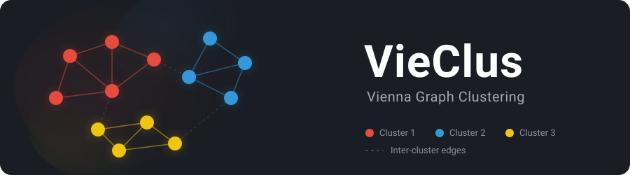

VieClus v1.2
[](https://opensource.org/licenses/MIT)
[](https://isocpp.org/)
[](https://cmake.org/)
[](https://github.com/KaHIP/VieClus/actions/workflows/build.yml)
[](https://github.com/KaHIP/VieClus/releases/latest)
[](https://pypi.org/project/vieclus/)
[](https://github.com/KaHIP/homebrew-kahip)
[](https://github.com/KaHIP/VieClus)
[](https://github.com/KaHIP/VieClus)
[](https://github.com/KaHIP/VieClus/stargazers)
[](https://github.com/KaHIP/VieClus/issues)
[](https://github.com/KaHIP/VieClus/commits)
[](https://arxiv.org/abs/1802.07034)
[](https://www.uni-heidelberg.de)
=====

<p align="center">
  
</p>

**VieClus** (Vienna Graph Clustering) is a memetic algorithm for high-quality graph clustering that optimizes modularity. It is the state-of-the-art solver for achieving the highest possible modularity values. Part of the [KaHIP](https://github.com/KaHIP) organization.

| | |
|:--|:--|
| **What it solves** | Graph clustering: detecting tightly connected regions (communities) in a graph |
| **Objective** | Maximize [modularity](https://en.wikipedia.org/wiki/Modularity_(networks)) |
| **Key result** | Improves or reproduces **all entries** of the 10th DIMACS Implementation Challenge |
| **Algorithm** | Memetic (evolutionary) algorithm with multilevel techniques and ensemble recombination |
| **Interfaces** | CLI, Python (`pip install vieclus`), C/C++ library |
| **Parallel** | Optional MPI support for parallel evolutionary search |

## Quick Start

### Install

| Method | Command |
|:-------|:--------|
| **Homebrew** (macOS/Linux) | `brew install KaHIP/kahip/vieclus` |
| **pip** (Python) | `pip install vieclus` |
| **Build from source** | `./compile_withcmake.sh` (with MPI) or `./compile_withcmake.sh NOMPI` |

### Run

**Command line:**
```bash
# With MPI (better solution quality through parallel evolutionary search)
mpirun -n 4 ./deploy/vieclus examples/astro-ph.graph --time_limit=60

# Without MPI
./deploy/vieclus examples/astro-ph.graph --time_limit=60
```

**Python (quickest way to get started):**
```python
import vieclus

g = vieclus.vieclus_graph()
g.set_num_nodes(6)
g.add_undirected_edge(0, 1, 5)
g.add_undirected_edge(1, 2, 5)
g.add_undirected_edge(0, 2, 5)
g.add_undirected_edge(3, 4, 5)
g.add_undirected_edge(4, 5, 5)
g.add_undirected_edge(3, 5, 5)
g.add_undirected_edge(2, 3, 1)  # weak bridge between two communities

vwgt, xadj, adjcwgt, adjncy = g.get_csr_arrays()
modularity, clustering = vieclus.cluster(vwgt, xadj, adjcwgt, adjncy, time_limit=1.0)

print(f"Modularity: {modularity}")   # e.g. 0.41
print(f"Clustering: {clustering}")   # e.g. [0, 0, 0, 1, 1, 1]
```

---

## Command Line Usage

```
mpirun -n P vieclus <graph-file> [options]
```

| Option | Description | Default |
|:-------|:-----------|:--------|
| `<graph-file>` | Path to graph in METIS format (see [Graph Format](#graph-format)) | *required* |
| `--time_limit=<double>` | Time limit in seconds. Must be > 0 to enable evolutionary recombination. | `0` |
| `--seed=<int>` | Random seed | `0` |
| `--output_filename=<string>` | Output file for the clustering | `tmpclustering` |
| `--help` | Print help | |

**Included tools:**

| Program | Homebrew name | Description |
|:--------|:-------------|:-----------|
| `vieclus` | `vieclus` | Main clustering algorithm |
| `graphchecker` | `vieclus_graphchecker` | Validate that a graph file is correctly formatted |
| `evaluator` | `vieclus_evaluator` | Compute modularity of a given clustering |

> **Note:** When installed via Homebrew, `graphchecker` and `evaluator` are prefixed with `vieclus_` to avoid name collisions with other tools (e.g. KaHIP). When built from source, the original names are used in `./deploy/`.

**Example workflow:**
```bash
# 1. Check your graph file
./deploy/graphchecker mygraph.graph          # from source
vieclus_graphchecker mygraph.graph           # via brew

# 2. Cluster it (4 MPI processes, 60 second time limit)
mpirun -n 4 ./deploy/vieclus mygraph.graph --time_limit=60 --output_filename=result.clustering

# 3. Evaluate the result
./deploy/evaluator mygraph.graph --input_partition=result.clustering          # from source
vieclus_evaluator mygraph.graph --input_partition=result.clustering           # via brew
```

---

## Python Interface

Install via pip:
```bash
pip install vieclus
```

Or build from source:
```bash
pip install .
```

### Using the `vieclus_graph` helper class

```python
import vieclus

g = vieclus.vieclus_graph()
g.set_num_nodes(6)

# Add edges (undirected, with weights)
g.add_undirected_edge(0, 1, 5)
g.add_undirected_edge(1, 2, 5)
g.add_undirected_edge(0, 2, 5)
g.add_undirected_edge(3, 4, 5)
g.add_undirected_edge(4, 5, 5)
g.add_undirected_edge(3, 5, 5)
g.add_undirected_edge(2, 3, 1)  # weak bridge between two communities

vwgt, xadj, adjcwgt, adjncy = g.get_csr_arrays()
modularity, clustering = vieclus.cluster(vwgt, xadj, adjcwgt, adjncy, time_limit=1.0)

print(f"Modularity: {modularity}")
print(f"Clustering: {clustering}")
```

### Using raw CSR arrays

```python
import vieclus

# Graph in METIS CSR format (same as KaHIP)
xadj    = [0, 2, 5, 7, 9, 12]
adjncy  = [1, 4, 0, 2, 4, 1, 3, 2, 4, 0, 1, 3]
vwgt    = [1, 1, 1, 1, 1]
adjcwgt = [1, 1, 1, 1, 1, 1, 1, 1, 1, 1, 1, 1]

modularity, clustering = vieclus.cluster(vwgt, xadj, adjcwgt, adjncy,
                                         suppress_output=True,
                                         seed=0,
                                         time_limit=2.0)

print(f"Modularity: {modularity}")
print(f"Clustering: {clustering}")
```

### API Reference

**`vieclus.cluster(vwgt, xadj, adjcwgt, adjncy, **kwargs)`**

| Parameter | Type | Default | Description |
|:----------|:-----|:--------|:------------|
| `vwgt` | list[int] | *required* | Node weights (length n) |
| `xadj` | list[int] | *required* | CSR index array (length n+1) |
| `adjcwgt` | list[int] | *required* | Edge weights (length m) |
| `adjncy` | list[int] | *required* | CSR adjacency array (length m) |
| `suppress_output` | bool | `True` | Suppress console output |
| `seed` | int | `0` | Random seed |
| `time_limit` | float | `1.0` | Time limit in seconds |
| `cluster_upperbound` | int | `0` | Max cluster size (0 = no limit) |

**Returns:** `(modularity: float, clustering: list[int])` where modularity is in [-1, 1] and clustering maps each node to a cluster ID.

**`vieclus.vieclus_graph`** -- helper class for building graphs (same interface as `kahip.kahip_graph`):

| Method | Description |
|:-------|:-----------|
| `set_num_nodes(n)` | Set the number of nodes |
| `add_undirected_edge(u, v, weight)` | Add an undirected edge with weight |
| `get_csr_arrays()` | Returns `(vwgt, xadj, adjcwgt, adjncy)` ready for `vieclus.cluster()` |

---

## C/C++ Library

Link against `libvieclus_static.a` and include `vieclus_interface.h`:

```cpp
#include "vieclus_interface.h"

int n = 5;
int xadj[]   = {0, 2, 5, 7, 9, 12};
int adjncy[] = {1, 4, 0, 2, 4, 1, 3, 2, 4, 0, 1, 3};

int clustering[5];
double modularity;
int num_clusters;

vieclus_clustering(&n, NULL, xadj, NULL, adjncy,
                   true,   // suppress_output
                   0,      // seed
                   10.0,   // time_limit
                   0,      // cluster_upperbound (0 = no limit)
                   &modularity, &num_clusters, &clustering[0]);
```

Build with:
```bash
./compile_withcmake.sh NOMPI
g++ -std=c++11 my_program.cpp -I interface/ -L build/ -lvieclus_static -lpthread -fopenmp -o my_program
```

---

## Graph Format

VieClus uses the **METIS graph format**, the same format used by [KaHIP](https://github.com/KaHIP/KaHIP), Metis, Chaco, and the 10th DIMACS Implementation Challenge.

### Input format

A plain text file with `n + 1` lines (excluding comments). Lines starting with `%` are comments and are skipped.

**Header line:**
```
n m [f]
```
- `n` = number of vertices, `m` = number of undirected edges
- `f` = format flag (optional): `0` = unweighted, `1` = edge weights, `10` = node weights, `11` = both

**Vertex lines (one per vertex):**
Each of the following `n` lines describes one vertex's adjacency list. For `f=1` (edge weights):
```
v1 w1 v2 w2 ...
```
where `v_i` are neighbor IDs (**1-indexed**) and `w_i` are edge weights.

**Example** (4 vertices, 5 edges, unweighted):
```
4 5
2 3
1 3 4
1 2 4
2 3
```

### Output format

The clustering output file contains `n` lines. Line `i` contains the cluster ID of vertex `i` (0-indexed). Cluster IDs are numbered consecutively from 0.

### Validating your graph

```bash
./deploy/graphchecker mygraph.graph
```

---

## How It Works

VieClus is a **memetic algorithm** that combines evolutionary search with multilevel graph clustering techniques:

1. **Multilevel approach**: The graph is recursively coarsened, an initial clustering is computed on the smallest graph, and local search improves the clustering at each level during uncoarsening.
2. **Evolutionary recombination**: A population of clusterings is maintained. Two parent clusterings are combined using an *ensemble clustering* overlay, where two vertices end up in the same cluster only if they agree in both parents.
3. **Parallel search** (with MPI): Multiple processes explore the solution space independently and exchange high-quality individuals, improving diversity and convergence.

More time and more MPI processes generally yield better modularity values. For details, see the [paper](https://arxiv.org/abs/1802.07034).

---

## Related Projects

| Project | Description |
|:--------|:-----------|
| [KaHIP](https://github.com/KaHIP/KaHIP) | Karlsruhe High Quality Graph Partitioning (flagship framework) |
| [CluStRE](https://github.com/KaHIP/CluStRE) | Fast streaming graph clustering |
| [KaMinPar](https://github.com/KaHIP/KaMinPar) | Shared-memory parallel graph partitioner |
| [KaHyPar](https://github.com/kahypar) | Karlsruhe Hypergraph Partitioning |

---

## Release Notes

### v1.2
- Added Python interface (`pip install vieclus`) with pybind11 bindings
- Added `vieclus_graph` helper class for easy graph construction (same interface as KaHIP)
- Added `vieclus.cluster()` function
- Added PyPI packaging with scikit-build-core
- Added GitHub Actions CI and automated PyPI publishing
- Added NOMPI compilation support

### v1.1
- Added cmake build system
- Added option to compile without MPI support

### v1.0
- Initial release of the memetic graph clustering algorithm

---

## Building from Source

### With MPI (recommended for best solution quality)

MPI enables the parallel evolutionary algorithm which typically yields better solutions.

**Prerequisites:** OpenMPI or Intel MPI

```bash
git clone https://github.com/KaHIP/VieClus.git
cd VieClus
./compile_withcmake.sh
```

Binaries are placed in `./deploy/`.

### Without MPI

```bash
./compile_withcmake.sh NOMPI
```

No additional dependencies beyond a C++11 compiler and CMake 3.10+.

---

## Licence

The program is licenced under MIT licence.
If you publish results using our algorithms, please acknowledge our work by quoting the following paper:

```
@inproceedings{BiedermannHSS18,
  author    = {Biedermann, Sonja and Henzinger, Monika and Schulz, Christian and Schuster, Bernhard},
  title     = {{Memetic Graph Clustering}},
  booktitle = {17th International Symposium on Experimental Algorithms (SEA 2018)},
  series    = {LIPIcs},
  volume    = {103},
  pages     = {3:1--3:15},
  publisher = {Schloss Dagstuhl -- Leibniz-Zentrum f{\"{u}}r Informatik},
  year      = {2018},
  doi       = {10.4230/LIPIcs.SEA.2018.3}
}
```
